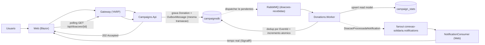

# Conexao Solidaria

<!-- Badge do pipeline de CI. owner/repo deduzidos do git remote (github.com/fenixdevsreborn/Fase5-POC-Hackathon).
     Ao dar fork/mover o repo, ajuste "fenixdevsreborn/Fase5-POC-Hackathon" para "<owner>/<repo>". -->
[](https://github.com/fenixdevsreborn/Fase5-POC-Hackathon/actions/workflows/ci.yml)

Plataforma social para o desafio do hackathon da ONG Esperanca Solidaria: doacoes processadas de forma **assincrona**, rastreabilidade ponta a ponta e transparencia visual para doadores e gestores. O foco de arquitetura e nunca perder uma doacao (Outbox transacional + mensageria confiavel), processar cada evento **exatamente uma vez** (idempotencia) e dar visibilidade completa (logs, traces, metricas e alertas).

Stack: .NET 10, .NET Aspire 13.2.0, Blazor Web App (MudBlazor), YARP, JWT/RBAC, PostgreSQL, RabbitMQ, Elasticsearch, Docker Desktop, Kubernetes (Kustomize), Grafana, Prometheus, Zabbix e OpenTelemetry.

## Visao do produto

- **Doador**: navega pelas campanhas publicas, cadastra-se, registra uma intencao de doacao (com valores rapidos), acompanha o processamento **em tempo real**, recebe comprovante e consulta o historico de "minhas doacoes".
- **Gestor da ONG (`GestorONG`)**: cria/edita campanhas, gerencia o ciclo de vida (ativar/concluir/cancelar), e acompanha arrecadacao e metricas de negocio em um painel.
- **Publico**: painel de transparencia com o total arrecadado por campanha ativa e detalhe publico de cada campanha, sem necessidade de login.

Detalhamento por persona em [docs/funcionalidades.md](docs/funcionalidades.md) (ver secao [Funcionalidades](#funcionalidades)).

## Arquitetura

Solucao com **9 projetos** de aplicacao/infra + **2 de teste** (`ConexaoSolidaria.slnx`).

Aplicacao (`src/`):

- `ConexaoSolidaria.AppHost`: orquestrador **.NET Aspire** — sobe todo o ambiente local (bancos, fila, busca e todos os servicos) com um unico comando e expoe o Aspire Dashboard (logs, traces, metricas, health).
- `ConexaoSolidaria.ServiceDefaults`: configuracao compartilhada de infra — OpenTelemetry (traces/metricas via OTLP), health checks (`/health`, `/alive`), service discovery e resiliencia HTTP.
- `ConexaoSolidaria.Gateway`: API Gateway **YARP** — ponto unico de entrada. Roteia `/api/auth/*` para a Identity e `/api/campanhas/*` + `/api/doacoes/*` para a Campaigns via service discovery; injeta `X-Correlation-Id`; aplica **rate limiting** (auth 10/min, donation 30/min, global 100/min); adiciona security headers + HSTS; expoe `/metrics`.
- `ConexaoSolidaria.Web`: interface **Blazor Web App (Interactive Server)** com MudBlazor — experiencia publica, area do doador e painel do gestor. Fala apenas com o Gateway. Auth via JWT em `ProtectedLocalStorage` + `AuthenticationStateProvider` custom; Data Protection keys persistidas (multi-replica). Consome o fanout `conexao-solidaria.notifications` via `NotificationConsumer` (BackgroundService resiliente, fila anonima) e empurra as atualizacoes para a UI por `NotificationDispatcher` (tempo real sobre o circuito SignalR do Blazor Server).
- `ConexaoSolidaria.Identity.Api`: cadastro de doadores, login e emissao de JWT (roles `GestorONG` e `Doador`); policies nomeadas `CampaignManagement` e `DonationCreation`; erros em ProblemDetails (422/409/401); **API versioning** (header `x-api-version`/query, default `1.0`). Referencia apenas `Contracts` (nao arrasta EF).
- `ConexaoSolidaria.Campaigns.Api`: CRUD de campanhas + **acoes de ciclo de vida**, busca com **fallback** Elasticsearch -> Postgres (circuit breaker Polly), transparencia publica (output cache), detalhe publico de campanha, `stats` (read model), intencao de doacao (`202 Accepted`) com **padrao Outbox**, consulta de status da doacao, historico "minhas doacoes", suporte a **Idempotency-Key** e **API versioning**; erros em ProblemDetails (422/409/404). Dona do schema do `campaignsdb` (aplica migrations no start).
- `ConexaoSolidaria.Donations.Worker`: consumidor RabbitMQ **idempotente** (dedup por `EventId` em `processed_messages`), com **retry escalonado (10s/60s) + DLQ** e **prefetch 10**; incrementa o valor arrecadado da campanha de forma **atomica** (`ExecuteUpdateAsync`), faz **upsert do read model `campaign_stats`** na mesma transacao e publica `DoacaoProcessadaNotification` no fanout de notificacoes (best-effort, so no sucesso).
- `ConexaoSolidaria.Contracts`: **tipos puros, sem EF** — contratos de mensageria e eventos (`DoacaoRecebidaEvent`, `DoacaoProcessadaNotification`), roles/`JwtOptions`, Value Object `Cpf` + validacao, e helpers de RabbitMQ (`RabbitMqOptions`, connection factory builder). Referenciado por todos os servicos sem acoplar persistencia.
- `ConexaoSolidaria.Shared`: **dominio + persistencia EF** — `Shared.Domain` (`Campaign` com transicoes Ativar/Concluir/Cancelar, `Donation` com estados Pendente/Processada/Rejeitada/Falha e transicao unica, `OutboxMessage`, `ProcessedMessage`, `DonationIdempotencyKey`, `CampaignStats`, `DomainRuleException`) e o **`CampaignsDbContext` unico** (`Shared.Persistence`, com EF Migrations) usado por Campaigns.Api e Worker.

Infraestrutura:

- **PostgreSQL**: `identitydb` (tabela `users`) e `campaignsdb` (tabelas `campaigns`, `donations`, `outbox_messages`, `processed_messages`, `donation_idempotency_keys`, `campaign_stats`). No compose/k8s ha ainda `zabbixdb`.
- **RabbitMQ**: exchanges `conexao-solidaria` (direct), `conexao-solidaria.retry`, `conexao-solidaria.dlx` e `conexao-solidaria.notifications` (fanout); filas `doacoes-recebidas`, `doacoes.retry.10s`, `doacoes.retry.60s`, `doacoes.dead-letter`.
- **Elasticsearch**: indice `campanhas` com **analisador pt-BR** (ignora acento, stemming, stopwords) e busca **fuzzy multi-campo** em titulo/descricao/categoria — tolera erro de digitacao e autocompleta por prefixo. O indice e criado no startup da API e populado com **backfill** do Postgres; com o ES indisponivel, a busca cai para o Postgres (ver `AD-35`/`AD-12`).
- **Grafana / Prometheus / Tempo / Zabbix / OpenTelemetry Collector**: observabilidade (ver secao dedicada).

### Fluxo assincrono da doacao



A intencao de doacao retorna `202 Accepted` imediatamente, mas a UI **nao** declara "Concluida" nesse ponto. A confirmacao chega por dois caminhos complementares: (1) **tempo real** — ao processar, o Worker publica `DoacaoProcessadaNotification` no fanout `conexao-solidaria.notifications`, o `NotificationConsumer` da Web recebe e empurra a atualizacao para o circuito SignalR do usuario; (2) **polling** de fallback em `GET /api/doacoes/{id}`, que confirma quando o status vira `Processada`. Isso garante rastreabilidade real do processamento assincrono.

## Funcionalidades

Resumo por persona (detalhes em [docs/funcionalidades.md](docs/funcionalidades.md)):

- **Doador**: doacao com **valores rapidos** (atalhos de montante) e validacao; **acompanhamento em tempo real** do processamento (SignalR) com fallback por polling; **comprovante** da doacao processada; **minhas doacoes** (historico do doador em `GET /api/doacoes/minhas`).
- **Gestor da ONG**: **CRUD** de campanhas e **acoes de ciclo de vida** (ativar/concluir/cancelar, com regras de transicao no dominio); **dashboard** com arrecadacao e metricas de negocio.
- **Publico**: lista de campanhas, **detalhe publico** de campanha (`GET /api/campanhas/{id}`) e **transparencia** (total arrecadado por campanha ativa, alimentado pelo read model), sem login.

## API

Endpoints expostos via Gateway. Versionamento por header `x-api-version` (ou query), default `1.0`; rotas atuais inalteradas. Erros em ProblemDetails (422 validacao/regra de dominio, 409 conflito, 404, 401/403, 429 rate limit).

| Metodo e rota | Acesso | Descricao |
| --- | --- | --- |
| `POST /api/auth/login` | anon | login, retorna JWT |
| `POST /api/auth/cadastro-doador` | anon | cadastro de doador (`201`) |
| `GET /api/auth/me` | autenticado | dados do usuario logado |
| `GET /api/campanhas/search` | anon | busca (Elasticsearch -> Postgres) |
| `GET /api/campanhas/{id}` | anon | detalhe publico da campanha |
| `GET /api/campanhas/transparencia` | anon | campanhas ativas (output cache 5s) |
| `GET /api/campanhas/stats` | anon | metricas do read model `campaign_stats` |
| `POST /api/campanhas` | Gestor | cria campanha (`201`) |
| `PUT /api/campanhas/{id}` | Gestor | edita campanha |
| `POST /api/campanhas/{id}/ativar\|concluir\|cancelar` | Gestor | acoes de ciclo de vida |
| `POST /api/doacoes` | Doador | intencao de doacao (`202`, aceita `Idempotency-Key`) |
| `GET /api/doacoes/{id}` | Doador | status enriquecido da doacao |
| `GET /api/doacoes/minhas` | Doador | historico do doador |

## Pre-requisitos

- SDK **.NET 10** (o AppHost usa o SDK do Aspire, restaurado via NuGet).
- **Docker Desktop** (o AppHost e o Docker Compose provisionam os containers de infra).
- `kubectl` (e, opcionalmente, o Kubernetes do Docker Desktop) para o deploy em cluster.

## Subir com AppHost (recomendado)

Experiencia principal de desenvolvimento — sobe **tudo** (Postgres, RabbitMQ, Elasticsearch, as 3 APIs, o Worker, o Gateway e a interface Blazor) com um comando:

```powershell
dotnet run --project src/ConexaoSolidaria.AppHost
```

O console imprime a URL do **Aspire Dashboard** (ex.: `https://localhost:17276`), onde ficam recursos, logs, traces, metricas, health e os links/portas de cada servico (portas atribuidas dinamicamente). Abra o recurso `web` para a interface e `gateway` para a API unificada.

Segredos locais: o AppHost gera automaticamente as senhas de Postgres/RabbitMQ e usa defaults de desenvolvimento para `jwt-secret` e `seed-manager-password` (em `src/ConexaoSolidaria.AppHost/appsettings.Development.json`). Para uso real, sobrescreva via user-secrets:

```powershell
dotnet user-secrets set "Parameters:jwt-secret" "<segredo-com-ao-menos-64-caracteres>" --project src/ConexaoSolidaria.AppHost
dotnet user-secrets set "Parameters:seed-manager-password" "<senha-forte-do-gestor-seed>" --project src/ConexaoSolidaria.AppHost
```

## Kubernetes com Kustomize

Os manifestos foram reestruturados em **Kustomize** (`infra/k8s/base/` + `infra/k8s/overlays/local/`), com hardening de producao: StatefulSet + PVC (postgres, rabbitmq), PVC dedicado (elasticsearch), Services `ClusterIP`, **Ingress nginx** como entrada unica (`/api` -> gateway, `/` -> web), probes (startup `/alive`, readiness `/health`, liveness `/alive`), requests/limits, `securityContext` (non-root `runAsUser 10001`, `readOnlyRootFilesystem`, drop ALL), **NetworkPolicies** (default-deny + allow-list, incluindo `web -> rabbitmq` e `migrations -> postgres`), **Jobs de migracao** (`RunMigrationsOnly=true`; deployments com `Migrations__RunOnStartup=false`), **HPA** (gateway, identity-api, campaigns-api por CPU) e PDB.

> **Deploy validado ao vivo** (Docker Desktop k8s v1.36.1): publicacao das 5 imagens no Docker Hub -> Secret -> Keel -> `kubectl apply -k`. Resultado: 12 pods `Running 1/1`, Jobs de migracao `Complete`, E2E de doacao processada em ~3s, read model populado e consumer de notificacoes conectado. Achado operacional: a NetworkPolicy precisa liberar os Jobs de migracao (`app=*-migrations`) para o Postgres; sem isso o schema nao nasce.

> O caminho mais simples é `pwsh infra/k8s/up.ps1` (um comando: Secret a partir do `.env`, Keel e `kubectl apply -k`). As imagens vêm do Docker Hub — veja **[Publicar no Docker Hub + auto-update](#publicar-no-docker-hub--auto-update-keel)** logo abaixo. Passo a passo manual equivalente:

```powershell
kubectl config use-context docker-desktop

# 1) Publicar as 5 imagens no Docker Hub (junonn5/conexao-solidaria-<svc>:latest)
$env:DOCKERHUB_TOKEN = "<seu_PAT_do_docker_hub>"
pwsh infra/k8s/push-dockerhub.ps1

# 2) Secret (fora do Git). Preencha os placeholders antes de aplicar.
Copy-Item infra/k8s/secret.example.yaml infra/k8s/secret.yaml
# edite infra/k8s/secret.yaml preenchendo os placeholders <...>
kubectl apply -f infra/k8s/secret.yaml

# 3) Keel (auto-update das imagens) + deploy (Kustomize)
kubectl apply -f infra/k8s/keel/keel.yaml
kubectl apply -k infra/k8s/overlays/local

# 4) (Opcional) smoke test automatizado
pwsh infra/k8s/smoke.ps1

kubectl get pods -n conexao-solidaria
kubectl get svc  -n conexao-solidaria
```

A entrada externa e o Ingress nginx no host `conexao-solidaria.local` (mapeie no `hosts` se necessario).

> O `up.ps1` **ja sobe os principais port-forwards em segundo plano** ao final do deploy (web `18088`, gateway `18080`, identity `18081`, campaigns `18082`, grafana `3000`, prometheus `9090`, rabbitmq `15672`) — eles continuam ativos apos o script e sao encerrados pelo `down.ps1`. Use `up.ps1 -NoForward` para desativar. Para servicos nao cobertos (ou fluxo manual), use `port-forward` direto:

```powershell
kubectl port-forward -n conexao-solidaria svc/grafana  3000:3000
kubectl port-forward -n conexao-solidaria svc/rabbitmq 15672:15672
kubectl port-forward -n conexao-solidaria svc/zabbix-web 8085:8080
```

> Renderizar o YAML final sem aplicar: `kubectl kustomize infra/k8s/overlays/local`. Detalhes completos em [infra/k8s/README.md](infra/k8s/README.md).

### Publicar no Docker Hub + auto-update (Keel)

O overlay local aponta para as imagens publicadas no Docker Hub (`junonn5/conexao-solidaria-<svc>:latest`), então o node as baixa direto do registry — não é mais preciso o `ctr import` manual. O **Keel** (instalado por `up.ps1` em `infra/k8s/keel/keel.yaml`) observa essas tags e, quando um novo push muda o digest de `:latest`, recria os pods sozinho (~1 min, `keel.sh/pollSchedule`).

Fluxo:

```powershell
# 1) Publicar as 5 imagens no Docker Hub (token via env — NUNCA versionado)
$env:DOCKERHUB_TOKEN = "<seu_PAT_do_docker_hub>"
pwsh infra/k8s/push-dockerhub.ps1

# 2) Subir a stack (puxa as imagens do Docker Hub e instala o Keel)
pwsh infra/k8s/up.ps1
#   ou, publicando e subindo de uma vez:
pwsh infra/k8s/up.ps1 -Publish

# 3) A partir daqui, para "soltar uma imagem nova" basta republicar:
pwsh infra/k8s/push-dockerhub.ps1   # o Keel detecta e atualiza os pods rodando

# Acompanhar o auto-update
kubectl get pods -n conexao-solidaria -w
kubectl logs -n keel deploy/keel -f
```

> O `docker login` usa `--password-stdin` lendo `$env:DOCKERHUB_TOKEN`; o token não é gravado em disco. Os repositórios são públicos, então o Keel puxa sem credenciais. Para outro usuário/registry, use `-User` em `push-dockerhub.ps1` e ajuste o bloco `images:` do overlay.

## Docker Compose (alternativa)

Caminho alternativo ao AppHost, util para reproduzir o ambiente completo com Grafana/Prometheus/Zabbix em portas fixas:

```powershell
Copy-Item .env.example .env   # preencha os segredos antes de subir
docker compose up --build
```

> O schema dos bancos e criado por **EF Core Migrations** (`MigrateAsync` no start da Campaigns.Api e da Identity.Api), **nao** por `EnsureCreated`. Ao migrar de uma stack antiga (criada com `EnsureCreated`), recrie os volumes com `docker compose down -v` antes de subir, para que as migrations criem o schema do zero em banco limpo.

Servicos:

- Identity Swagger: http://localhost:5001/swagger
- Campaigns Swagger: http://localhost:5002/swagger
- Worker health: http://localhost:5003/health
- Elasticsearch: http://localhost:9200
- RabbitMQ: http://localhost:15672 (`RABBITMQ_USER` / `RABBITMQ_PASSWORD` no `.env`)
- Prometheus: http://localhost:9090
- Grafana: http://localhost:3000 (`GRAFANA_ADMIN_USER` / `GRAFANA_ADMIN_PASSWORD` no `.env`)
- Zabbix: http://localhost:8085

Usuario gestor criado no seed:

- Email: `gestor@conexaosolidaria.local`
- Role: `GestorONG`
- Senha: via variavel de ambiente `Seed__Gestor__Senha` (mapeada de `SEED_MANAGER_PASSWORD` no `.env`, documentada no `.env.example`). Nunca commite a senha real.

## Interface web (Blazor)

Rotas da aplicacao `ConexaoSolidaria.Web` (abra pelo recurso `web` no Aspire Dashboard ou pelo Ingress):

- Publico: `/` (landing), `/campanhas`, `/campanhas/{id}`, `/transparencia`
- Conta: `/entrar`, `/cadastrar`
- Doador: `/doador`, `/doador/doacoes` (minhas doacoes), `/doador/doacoes/{id}` (acompanhamento em tempo real da doacao)
- Gestor: `/gestor` (dashboard + graficos), `/gestor/campanhas/nova`, `/gestor/campanhas/{id}/editar`
- Diagnostico: `/status`

## Observabilidade

Telemetria end-to-end com correlacao por `X-Correlation-Id` e propagacao de `traceparent` ate o Worker.

- **OpenTelemetry**: instrumentacao via `ServiceDefaults`, exportando traces/metricas por OTLP. Local: Aspire Dashboard. Compose/k8s: **OTel Collector** (`infra/otel/`) roteia os traces para o **Tempo** (`infra/tempo/`, datasource no Grafana) e as metricas para o Prometheus.
- **Tracing distribuido**: traces correlacionados app -> OTel Collector -> Tempo, exploraveis na aba Explore do Grafana (datasource `Tempo`), com `traceparent` propagado ate o Worker.
- **Prometheus + prometheus-net**: endpoint `/metrics` em todos os servicos (incluindo o Gateway); Prometheus faz scrape. Metricas custom de negocio/mensageria: `conexao_donations_processed_total`, `conexao_donations_rejected_total`, `conexao_donation_publish_total`, `conexao_donation_publish_failures_total`, `conexao_outbox_pending_messages`, `conexao_donation_processing_duration_seconds`, `conexao_dead_letter_messages`.
- **Grafana**: dashboards provisionados em `infra/grafana/dashboards/` (`negocio.json`, `aplicacao.json`, `mensageria.json`) e alertas em `infra/grafana/provisioning/alerting/` (DLQ > 0, Outbox > 20 por 2 min, 5xx).
- **Zabbix**: template real em `infra/zabbix/templates/` (itens HTTP + 9 triggers) para monitoramento complementar.
- **Runbook e cenario de falha**: [docs/runbook.md](docs/runbook.md) e [docs/cenario-falha-recuperacao.md](docs/cenario-falha-recuperacao.md) descrevem operacao, alertas e o roteiro de falha/recuperacao (ex.: derrubar o RabbitMQ, ver o Outbox acumular e recuperar sem perda).

## Testes

```powershell
dotnet test ConexaoSolidaria.slnx
```

- `tests/ConexaoSolidaria.Tests`: **23 testes unitarios** (regras de dominio + persistencia EF com SQLite in-memory).
- `tests/ConexaoSolidaria.IntegrationTests`: **12 testes de integracao** com **Testcontainers** (Postgres + RabbitMQ reais): identity, campaigns, outbox, fluxo assincrono completo, idempotencia por `EventId` e por `Idempotency-Key`, e populacao do read model `campaign_stats`.

## Padroes e decisoes

Resumo (detalhes e trade-offs em [docs/decisoes-arquiteturais.md](docs/decisoes-arquiteturais.md)):

- **Outbox transacional**: a doacao e o evento sao gravados na mesma transacao; um dispatcher publica com publisher confirms. Garante que nenhuma doacao aceita se perca, mesmo com o broker fora do ar.
- **Idempotencia**: entrada protegida por **Idempotency-Key** (evita doacao duplicada na API) e consumo protegido por dedup de **`EventId`** em `processed_messages` (evita processamento duplicado no Worker).
- **DLQ + retry escalonado**: falhas vao para filas de retry (10s/60s) e, esgotadas as tentativas, para a dead-letter — sem travar o consumo.
- **Incremento atomico**: o Worker soma no `ValorTotalArrecadado` via `ExecuteUpdateAsync` (UPDATE no banco), evitando race conditions.
- **ProblemDetails**: erros padronizados (422/409/404/401) nas APIs.
- **RBAC com policies nomeadas**: roles `GestorONG`/`Doador` + policies `CampaignManagement`/`DonationCreation`.
- **Rate limiting** no Gateway (auth 10/min, donation 30/min, global 100/min).
- **CQRS leve**: read model `campaign_stats` (upsert pelo Worker) serve leituras de transparencia/stats sem tocar o modelo de escrita.
- **Notificacao em tempo real**: fanout `conexao-solidaria.notifications` -> `NotificationConsumer` da Web -> push SignalR, com polling como fallback.
- **EF Migrations** (`MigrateAsync`) como fonte do schema; Campaigns.Api e dona do `campaignsdb` e o Worker aguarda a migracao.
- **API versioning** por header `x-api-version` (default `1.0`) nas APIs.
- **Value Object `Cpf`** com validacao e mascara.

Detalhes e trade-offs em [docs/decisoes-arquiteturais.md](docs/decisoes-arquiteturais.md) (AD-01..AD-24) e catalogo de funcionalidades em [docs/funcionalidades.md](docs/funcionalidades.md).

## Matriz de rastreabilidade

| Requisito do desafio | Onde esta implementado |
| --- | --- |
| Microsservicos / separacao de dominios | `Identity.Api`, `Campaigns.Api`, `Donations.Worker`, `Gateway` |
| Processamento **assincrono** de doacoes | Outbox (Campaigns.Api) + RabbitMQ + `Donations.Worker` |
| Confiabilidade da mensageria (nao perder doacao) | Outbox transacional + publisher confirms + retry/DLQ |
| Idempotencia / exactly-once | `Idempotency-Key` + dedup por `EventId` (`processed_messages`) |
| Autenticacao e RBAC | JWT na `Identity.Api`; policies no Gateway/APIs |
| API Gateway / ponto unico | `Gateway` (YARP) + Ingress nginx |
| Busca de campanhas | Elasticsearch (`indice campanhas`, analisador pt-BR + fuzzy multi-campo) com fallback Postgres |
| Transparencia publica | `GET /api/campanhas/transparencia` + `stats` (read model) + pagina `/transparencia` |
| Notificacao em tempo real | fanout `conexao-solidaria.notifications` + `NotificationConsumer` (SignalR) |
| Interface web (doador + gestor) | `ConexaoSolidaria.Web` (Blazor + MudBlazor) |
| Observabilidade (logs/traces/metricas/alertas) | OTel + OTel Collector + Tempo + Prometheus + Grafana + Zabbix |
| Orquestracao local | `AppHost` (.NET Aspire) |
| Deploy em Kubernetes | Kustomize `infra/k8s/` (base + overlay local); deploy validado ao vivo |
| Testes automatizados | `tests/` (23 unit + 12 integracao Testcontainers) |
| Seguranca de segredos | `.env.example`, `SECURITY.md`, Secret via example no k8s |

## Seguranca

Sem segredos versionados: `.env.example`, Secret do k8s gerado a partir de `infra/k8s/secret.example.yaml`, senha do gestor seed via env `Seed__Gestor__Senha` e mascara de CPF. Politica completa em [SECURITY.md](SECURITY.md). Nunca commite tokens, senhas ou qualquer segredo real.

Os tokens JWT sao obtidos em tempo de execucao fazendo login (`POST /api/auth/login` para o gestor, `POST /api/auth/cadastro-doador` para um doador) e copiando o `accessToken` da resposta.

## CI/CD

O workflow multi-job em `.github/workflows/ci.yml` executa a cada push/pull request para `main`/`master`:

- **quality**: restore + cache NuGet, `dotnet format`/scan de vulnerabilidades (report-only), `dotnet build` (Release).
- **tests**: unit + integracao (Testcontainers), cobertura XPlat publicada como artifact.
- **containers**: build das **5 imagens** (matrix, Buildx + cache) — Identity.Api, Campaigns.Api, Donations.Worker, Gateway e Web.
- **kubernetes-validation**: `kustomize build` + `kubeconform`.
- **publish** (so `main`): push das 5 imagens no GHCR.

> **Dois registries, de proposito.** O CI publica no **GHCR** (rastreabilidade por commit: tags `:sha` e `:latest`), enquanto o **ambiente local consome o Docker Hub** (`junonn5/conexao-solidaria-*:latest`, publicado por `push-dockerhub.ps1`) — que e de onde o cluster baixa as imagens e o Keel observa para o auto-update. Para apontar o cluster ao GHCR, basta trocar o bloco `images:` em `infra/k8s/overlays/local/kustomization.yaml`.

Complementos: **Dependabot** (nuget/actions/docker), PR template Spec-Driven e badge do pipeline no topo deste README.

## Documentacao

- Arquitetura e modelo de dados: [docs/arquitetura.md](docs/arquitetura.md)
- Observabilidade (metricas, dashboards, alertas): [docs/observabilidade.md](docs/observabilidade.md)
- Funcionalidades por persona: [docs/funcionalidades.md](docs/funcionalidades.md)
- Decisoes arquiteturais: [docs/decisoes-arquiteturais.md](docs/decisoes-arquiteturais.md)
- Runbook operacional: [docs/runbook.md](docs/runbook.md)
- Cenario de falha e recuperacao: [docs/cenario-falha-recuperacao.md](docs/cenario-falha-recuperacao.md)
- Justificativa dos bancos: [docs/justificativa-bancos.md](docs/justificativa-bancos.md)
- Guia Kubernetes: [infra/k8s/README.md](infra/k8s/README.md)
- Politica de seguranca: [SECURITY.md](SECURITY.md)
</content>
</invoke>
