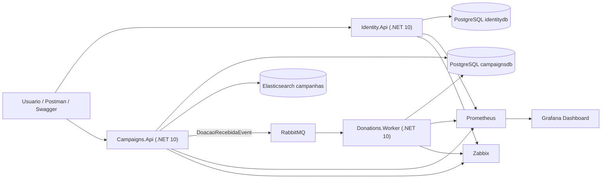

# Arquitetura

## Decisoes principais

- A separacao entre `Identity.Api`, `Campaigns.Api` e `Donations.Worker` atende ao requisito de microsservicos.
- A doacao e recebida pela API, mas o valor arrecadado so e atualizado pelo worker apos consumo do evento no RabbitMQ.
- JWT centraliza autenticacao e RBAC, com roles `GestorONG` e `Doador`.
- O painel publico de transparencia consulta apenas campanhas ativas no PostgreSQL; a busca fuzzy por titulo fica separada no endpoint `transparencia-search`, usando Elasticsearch.
- Health checks e metricas ficam expostos em `/health` e `/metrics`.
