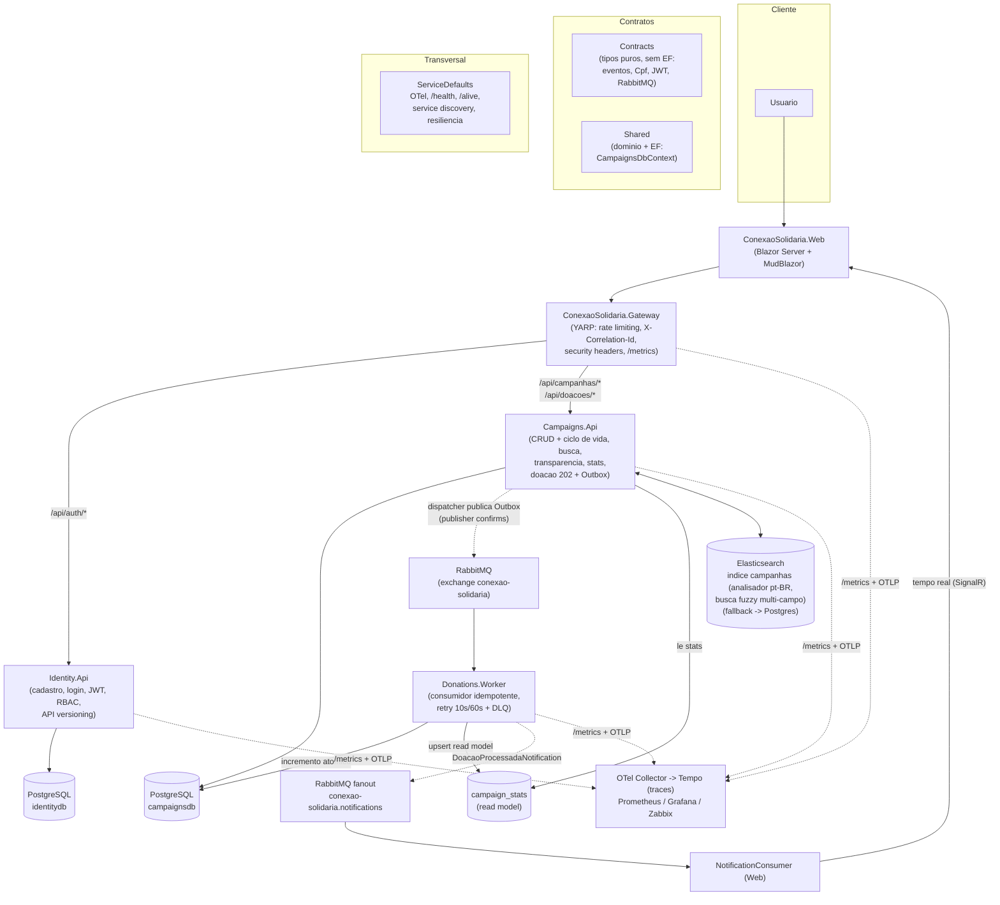

# Arquitetura

Conexao Solidaria e um conjunto de servicos .NET 10 (8 projetos de app/infra + 2 de teste) implantados em **Kubernetes** (Kustomize), com entrada unica por um Gateway YARP e processamento **assincrono** de doacoes via Outbox + RabbitMQ, read model (CQRS leve) e notificacoes em tempo real. Esta pagina descreve os componentes, os fluxos assincrono e de notificacao, o modelo de dados e a observabilidade.

## Componentes

## Responsabilidades

- **ServiceDefaults**: OpenTelemetry (traces/metricas via OTLP), health checks `/health` e `/alive`, service discovery e resiliencia HTTP — referenciado por todos os servicos.
- **Gateway (YARP)**: ponto unico de entrada. Roteia `/api/auth/*` para a Identity e `/api/campanhas/*` + `/api/doacoes/*` para a Campaigns via service discovery; injeta `X-Correlation-Id`; aplica rate limiting (auth 10/min, donation 30/min, global 100/min); adiciona security headers + HSTS; expoe `/metrics`.
- **Web (Blazor Server + MudBlazor)**: UI publica, area do doador e painel do gestor. Fala apenas com o Gateway. Auth via JWT em `ProtectedLocalStorage` + `AuthenticationStateProvider` custom; Data Protection keys persistidas (multi-replica). Consome o fanout `conexao-solidaria.notifications` (`NotificationConsumer`, fila anonima) e empurra as atualizacoes para a UI via `NotificationDispatcher` (tempo real sobre o circuito SignalR); o **polling** em `GET /api/doacoes/{id}` funciona como fallback.
- **Identity.Api**: cadastro de doadores, login e emissao de JWT (roles `GestorONG` e `Doador`); policies `CampaignManagement`/`DonationCreation`; erros em ProblemDetails; **API versioning** (header `x-api-version`/query, default `1.0`). Aplica migrations do `identitydb` no start. Referencia apenas `Contracts`.
- **Campaigns.Api**: CRUD de campanhas + **acoes de ciclo de vida** (Ativar/Concluir/Cancelar), **busca fuzzy multi-campo** no Elasticsearch (indice com analisador pt-BR criado no startup + backfill do Postgres) com fallback -> Postgres, transparencia publica e detalhe publico de campanha, endpoint `stats` (le o read model `campaign_stats`), intencao de doacao (`202 Accepted`) gravada com **Outbox** na mesma transacao, consulta de status, historico "minhas doacoes" e **Idempotency-Key**; **API versioning**. Dona do `campaignsdb`: aplica as migrations (`MigrateAsync`) no start.
- **Donations.Worker**: consome `doacoes-recebidas`, deduplica por `EventId` (`processed_messages`), incrementa o valor arrecadado com `ExecuteUpdateAsync` (atomico), faz **upsert do read model `campaign_stats`** na mesma transacao e publica `DoacaoProcessadaNotification` no fanout `conexao-solidaria.notifications` (best-effort). Usa **prefetch 10**, retry escalonado (10s/60s) + DLQ e execution strategy no EF. Aguarda o schema estar migrado antes de consumir.
- **Contracts**: **tipos puros, sem EF** — eventos (`DoacaoRecebidaEvent`, `DoacaoProcessadaNotification`), roles/`JwtOptions`, VO `Cpf` + validacao e helpers de RabbitMQ (`RabbitMqOptions`, connection factory builder). Referenciado por todos os servicos sem acoplar persistencia.
- **Shared**: **dominio + persistencia EF** — `Campaign`, `Donation` (estados Pendente/Processada/Rejeitada/Falha), `OutboxMessage`, `ProcessedMessage`, `DonationIdempotencyKey`, `CampaignStats`, `DomainRuleException`, e o `CampaignsDbContext` unico com EF Migrations, usado por Campaigns.Api e Worker.

## Fluxo assincrono da doacao

1. O doador registra a intencao pela Web, que chama o Gateway (`POST /api/doacoes`) com um `Idempotency-Key`.
2. A **Campaigns.Api** grava, na **mesma transacao**, o registro `Donation` (status `Pendente`) e uma `OutboxMessage` com o evento `DoacaoRecebidaEvent`. Se o `Idempotency-Key` ja existir, retorna a doacao original. Responde `202 Accepted`.
3. Um **dispatcher** varre as `outbox_messages` pendentes e publica no RabbitMQ (exchange `conexao-solidaria`, fila `doacoes-recebidas`) com **publisher confirms** e propagacao de `traceparent`. Falhas de publicacao mantem a mensagem pendente para nova tentativa.
4. O **Donations.Worker** consome o evento. Se o `EventId` ja esta em `processed_messages`, descarta (idempotencia). Caso contrario, na mesma transacao: incrementa o `ValorTotalArrecadado` da campanha de forma atomica, marca a `Donation` como `Processada`, faz **upsert do read model `campaign_stats`** e registra o `EventId`.
5. Apos o commit, o Worker publica `DoacaoProcessadaNotification` no fanout `conexao-solidaria.notifications` (best-effort, so no sucesso).
6. Erros de consumo seguem para `doacoes.retry.10s` -> `doacoes.retry.60s` e, esgotadas as tentativas, para `doacoes.dead-letter`.
7. A Web confirma a doacao por dois caminhos: **tempo real** (item abaixo) e **polling** de fallback em `GET /api/doacoes/{id}` — nunca confia apenas no `202`.

O evento `DoacaoRecebidaEvent` e versionado (`CorrelationId` + `SchemaVersion`) para evolucao de contrato.

## Fluxo de notificacao em tempo real

1. Ao concluir o processamento, o **Worker** publica `DoacaoProcessadaNotification` (DoacaoId, CampanhaId, titulo, valor, total arrecadado, meta, `MetaAtingida`, timestamp) no **exchange fanout** `conexao-solidaria.notifications`.
2. Cada instancia da **Web** tem um `NotificationConsumer` (BackgroundService resiliente) com uma **fila anonima** ligada ao fanout — todas as replicas recebem a notificacao.
3. O `NotificationDispatcher` roteia a mensagem para os circuitos SignalR interessados (doador que acompanha a doacao, painel do gestor), atualizando a UI **sem recarregar** e exibindo o comprovante.
4. Se a Web estiver desconectada quando a notificacao chega, o **polling** em `GET /api/doacoes/{id}` garante a convergencia do estado.

## Modelo de dados

**`identitydb`**

| Tabela | Conteudo |
| --- | --- |
| `users` | usuarios (gestor e doadores), credenciais e role |

**`campaignsdb`** (schema unico do `CampaignsDbContext`, compartilhado por Campaigns.Api e Worker)

| Tabela | Conteudo |
| --- | --- |
| `campaigns` | campanhas: titulo, descricao, `MetaFinanceira`, `ValorTotalArrecadado`, `Status` (Rascunho/Ativa/Concluida/Cancelada), datas |
| `donations` | doacoes: `DoadorId`, `DoadorEmail`, `Valor`, `Status` (Pendente/Processada/Rejeitada/Falha), FK `CampaignId`; indices por campanha e `DoadorId` |
| `outbox_messages` | Outbox transacional: `EventType`, `SchemaVersion`, `Payload` (jsonb), `CorrelationId`, tentativas e `NextAttemptAtUtc`; indice parcial `WHERE PublishedAtUtc IS NULL` |
| `processed_messages` | dedup do consumo por `EventId` (chave primaria, valor nao gerado) |
| `donation_idempotency_keys` | mapeia `Idempotency-Key` -> `DonationId` para evitar doacao duplicada |
| `campaign_stats` | **read model (CQRS)**: `CampaignId`, `Titulo`, `MetaFinanceira`, `TotalArrecadado`, `DoacoesProcessadas`, `AtualizadoEm` — upsert pelo Worker; serve `transparencia`/`stats` |

O schema e criado e evoluido por **EF Core Migrations** (`InitialCreate` + `AddPerformanceIndexes`) aplicadas com `MigrateAsync` — nao por `EnsureCreated`. Em k8s, as migrations rodam em **Jobs dedicados** (`RunMigrationsOnly=true`) e os deployments sobem com `Migrations__RunOnStartup=false`.

## Observabilidade

- **Traces/metricas** via OpenTelemetry (ServiceDefaults) exportados por OTLP para o **OTel Collector** (`infra/otel/`), que roteia traces para o **Tempo** (`infra/tempo/`) e metricas para o Prometheus.
- **Tracing distribuido**: traces correlacionados app -> OTel Collector -> Tempo, exploraveis na aba Explore do Grafana (datasource `Tempo`, API em `:3200`), com `traceparent` propagado ate o Worker (incluindo o salto pela fila).
- **`/metrics`** (prometheus-net) em todos os servicos, incluindo o Gateway; Prometheus faz scrape (5s). Alem das metricas HTTP e de runtime (.NET/processo), ha metricas custom de negocio/mensageria: `conexao_donations_processed_total`, `conexao_donations_rejected_total`, `conexao_donation_publish_total`, `conexao_donation_publish_failures_total`, `conexao_outbox_pending_messages`, `conexao_donation_processing_duration_seconds`, `conexao_dead_letter_messages` e as de valor/campanha `conexao_donation_amount_brl_total`, `conexao_donations_by_campaign_total{campanha}`, `conexao_donation_amount_by_campaign_brl_total{campanha}`.
- **RabbitMQ** expoe metricas nativas do broker em `:15692` (plugin `rabbitmq_prometheus`): fila `ready`/`unacked`, consumidores. Prometheus tambem coleta `up` e `scrape_duration_seconds` (saude rodando/parado).
- **Grafana** com dashboards provisionados (`infra/grafana/dashboards/`: **negocio**, **aplicacao**, **mensageria**, **saude**), datasources Prometheus + Tempo e alertas (`infra/grafana/provisioning/alerting/`: DLQ > 0, Outbox > 20 por 2 min, 5xx).
- **Zabbix** com template real em `infra/zabbix/templates/` (itens HTTP + 9 triggers) para monitoramento complementar.
- Correlacao ponta a ponta via `X-Correlation-Id` (Gateway) e `traceparent` propagado ate o Worker. Detalhes completos em [observabilidade.md](observabilidade.md); ver tambem [runbook.md](runbook.md) e [cenario-falha-recuperacao.md](cenario-falha-recuperacao.md).

## Decisoes principais

- Separacao em servicos (`Identity.Api`, `Campaigns.Api`, `Donations.Worker`, `Gateway`) atende ao requisito de microsservicos, com entrada unica pelo Gateway.
- A doacao e aceita pela API (`202`), mas o valor arrecadado so muda apos o Worker consumir o evento — desacoplando recebimento de processamento.
- Confiabilidade garantida por Outbox transacional + publisher confirms + retry/DLQ; exactly-once efetivo por idempotencia de entrada (`Idempotency-Key`) e de consumo (`EventId`).
- **Separacao Contracts vs Shared**: `Contracts` carrega os tipos puros (eventos, VO, opcoes) sem EF, evitando que servicos como a Identity.Api arrastem persistencia; `Shared` concentra dominio + `CampaignsDbContext`.
- **CQRS leve**: o Worker mantem o read model `campaign_stats` (upsert na mesma transacao do processamento), que serve leituras de transparencia/stats sem tocar o modelo de escrita.
- **Notificacao em tempo real**: fanout `conexao-solidaria.notifications` -> `NotificationConsumer` da Web -> push SignalR, com polling como fallback.
- **API versioning** por header `x-api-version` (default `1.0`) para evoluir contratos sem quebrar clientes.
- JWT centraliza autenticacao e RBAC (`GestorONG`/`Doador`) com policies nomeadas.
- O painel publico de transparencia consulta apenas campanhas ativas.
- Health checks (`/health`, `/alive`) e metricas (`/metrics`) expostos por todos os servicos; traces enviados ao Tempo via OTel Collector.
- **Deploy k8s validado ao vivo** (Docker Desktop k8s): 12 pods `Running`, Jobs de migracao `Complete`, E2E de doacao em ~3s e read model populado.
</content>
